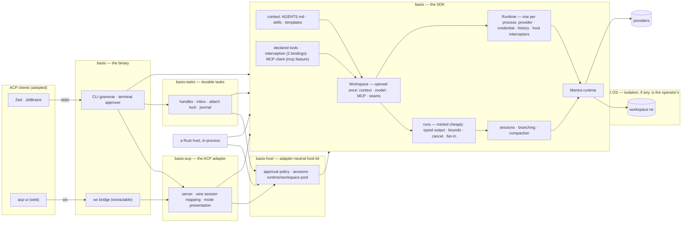

# basis — Architecture

> rev 14 · 2026-09-01 · **basis** — the minimal set everything else is built from
> The *how*. For the *why* — problem, idea, bets — see [`PROPOSAL.md`](PROPOSAL.md);
> locked decisions live in [`adr/`](adr/); deferred ideas in [`proposals/`](proposals/);
> research grounding in [`p0-groundwork.md`](p0-groundwork.md).
> **Note (2026-08-11):** ADR-0010…0015 redirect the design toward an SDK-first
> shape. **Phases A, B, C and D of that transition have landed** — watch retired,
> bounds moved onto runs, shell default flipped, no shipped container, the CLI
> grammar of ADR-0015; the split into five dependency-weighted crates with
> MCP behind a feature and approval as a trait; the SDK proper — a
> `Workspace` opened once that mints runs, typed output, cancellation, a shared
> budget, and tagged event fan-in; and the bindings — interception as one
> contract with two bindings, and the workspace's history put where the caller
> says. §2, §3 and §4 below describe the state after them. Phase D's last item,
> declared subprocess tools, was held for seven revs and shipped in rev 12
> against the first concrete use case; where this document still describes the
> P0–P4 shape it says so. A later wave belonging to no phase closed the last
> five upstream candidates — a typed turn can now keep its tools, a run names
> the bound that ended it, and `basis`'s graph carries no websocket stack — and
> the wave after it measured basis against pi capability by capability and
> closed what that found: the split file-tool roster, compaction configured by
> basis, the shared skill roots and `CLAUDE.md`, a system-prompt seam, a shell
> that streams, and per-session model and effort over ACP. The wave after
> *that* went to mentra with everything basis could not build alone and came
> back the same day: a base URL speaks `chat/completions` and needs no key, a
> hook runs after a tool as well as before, compaction knows the model's
> window, a conversation can be compacted, renamed, listed by recency and
> deleted, and a delegated run's spend is finally in its parent's tally. The
> adapter-neutral approval policy, served-session source, runtime/workspace
> pool, and turn discipline have since moved out of ACP into `basis-host`, with
> ACP retaining only protocol translation (ADR-0025). Programmatic hosts can
> now supply typed hooks and declared tools without file discovery. The ledger and phases are
> in [`REDESIGN.md`](REDESIGN.md).
> Reference bar: [pi](https://github.com/earendil-works/pi) (earendil-works) — minimal core, complete harness.
> General-purpose: no domain assumptions. Periodic bug-checking is one use case, never a design input.

basis is a coding-agent harness in Rust, built on [Mentra](https://github.com/oops-rs/mentra), with
the shape pi proved out: a small but **complete** core — sessions, compaction, multi-provider,
context conventions, extension points — everything else arriving as data or plugins. No TUI.
Embedding is the front door: ACP for editors and web UIs, a JSONL event stream for scripts, the
crate itself as the SDK.

## 1. The bar: what "full-functional" means

pi's thesis: *stay small at the core while being extended through extensions, skills, prompt
templates, and packages.* Its core is nonetheless complete — sessions with branching and tree
navigation, context compaction, unified multi-provider access, RPC headless mode, an SDK,
hot-reloadable extensions. Two pi decisions independently validate ours:

- **No built-in permission system.** pi ships none and says "containerize or sandbox pi" —
  the posture we arrived at independently and adopted knowingly in ADR-0013: the boundary is
  the OS's, documented rather than shipped.
- **Embedding via protocol.** pi's RPC mode is a bespoke JSONL protocol over stdio. We take the
  same architecture but adopt the *standard* — ACP — so every existing client works without a
  custom client library.

| Capability (pi has it) | Ours | Source |
|---|---|---|
| Agent loop + tool calling | Mentra runtime, async tool traits | mentra |
| Multi-provider LLM API | mentra-provider: OpenAI, Anthropic, Gemini, OpenRouter, Ollama, LM Studio — and any `chat/completions` endpoint by base URL, keyed or not (§8) ✅ | mentra |
| Session persistence + resume | File-backed sessions (plain files under the store dir since 0.7, ADR-0023 — basis links no database), snapshots | mentra |
| Compaction | mentra's compaction, configured by basis (`Compaction`) ✅ — every tool result the model was shown is kept, elision is opt-in by number, the trigger is a share of the model's window when the provider reports one — clearing the absolute token threshold leaves that share as the whole trigger rather than turning the feature off — and snapshots follow the store; `PreparedRun::compact` and ACP `/compact` run a pass on demand, bounded by the run's cancel and deadline (`compact_with_options`) | built |
| Session branching / tree | mentra's transcript tree, exposed on `PreparedRun` ✅ | built |
| Lossless host observation | `PreparedRun::register_agent_event_tap` forwards complete Mentra `AgentEvent`s in occurrence order behind an opaque Basis guard; JSONL remains summary-only ✅ | mentra + built |
| Strict private-runtime reuse | Repeatable registered-provider recipe, discovery-off/fresh-only/resolved-model/exact-roster workspace, explicit per-generation host-tool bind, consuming async rebuild ✅ | built |
| Builtin tools (files, shell, background exec, tasks) | Mentra builtins, with the roster basis's: `read`, `ls`, `grep`, `glob`, `write`, `edit` (mentra's split file tools, `RuntimeBuilder::with_file_tools`), `compact`, `load_skill`, and `spawn` for commands and delegation. `shell`, `background_run`, `check_background`, `task`, `task_*`, `team_*`, `idle` and — since D2 switched mentra's memory engine off — `memory_pin`/`memory_forget`/`memory_search` are registered but not offered ✅ | mentra + built |
| Context files (AGENTS.md) | Loader: workspace + global, parent-dir walk; `CLAUDE.md` per directory where there is no `AGENTS.md` | build |
| Skills (on-demand) | SKILL.md discovery, description-first loading, four roots — `.basis/skills` and `.agents/skills` in the workspace, `skills/` in the global config dir and `~/.agents/skills`; each root registered at open and handed back when the workspace drops, so a shared runtime holds only the skills of the repositories still open ✅ | build |
| Prompt templates (/commands) | Markdown templates with args, exposed over ACP as commands ✅ | built |
| Extensions (custom tools, event interception) | MCP servers + typed/file-declared subprocess tools + runtime-scoped native tools + interception with two bindings — in-process `Interceptor`, subprocess hooks — before a call (allow/deny/modify) and after it (keep/replace) (§3) ✅ | built |
| Packages (shareable bundles) | Directory convention over skills/templates/hooks/MCP — defer | later |
| RPC / headless mode | `spawn --json` event stream (`run` is a compatibility alias) + **ACP** (standard, not bespoke) ✅; durable task control over a global data directory, with no resident process of any kind ✅; the model and the reasoning effort are per-session config options a client sets over the protocol, where pi spends six RPC commands ✅ | built |
| SDK | `basis`: a `Workspace` opened once, runs minted from it with typed output, bounds, cancellation ✅ — other languages use ACP | built |
| TUI / themes / keybindings | Out of scope by design — ACP clients own presentation | — |
| Provider OAuth login flows | API-key auth first; OAuth per provider later | later |

## 2. Principle: the core has no opinions

Task-specific behavior enters through data, never code: the **prompt**, the **workspace** (its
AGENTS.md, skills, templates, `.basis/tools.json`, `.mcp.json`), and **config**. A periodic code-health check, a
nightly dependency bump, an interactive refactor are all the same to the binary. If a use case
seems to need core changes, close the gap generically or push it to an extension point.

```
basis "<prompt>"                     # shorthand: exactly `basis spawn "<prompt>"`
basis "/<template> <args>"           # a first token naming a `.basis/templates` command
basis spawn "<prompt>"               # at a shell: drive it here; in a task: return a handle
basis spawn "<prompt>" --resumable   # return a durable handle without driving it
basis spawn "<prompt>" --continue    # a new task on the conversation last worked in here
basis spawn "<prompt>" --session <TASK>  # the same, on the conversation that handle names
basis list                           # this workspace's tasks, last worked in first
basis send <ID> "<message>"          # enqueue a follow-up turn and return its message ID
basis send <ID> "<message>" --await  # enqueue, then await that message's reply
basis ask <ID> "<question>"          # send and await the correlated reply
basis wait <ID>                      # repeatable terminal observation
basis wait <ID> --message <MID>       # await/retry one message's reply
basis cancel <ID>                    # downward cancellation request
basis watch <ID>                     # replayable progress observation
basis inbox [ID]                     # bounded message/reply summaries
basis serve --acp                    # ACP server on stdio (explicit)
basis serve --bridge                 # the same server on a websocket, for a browser
basis fingerprint                    # the workspace's hash, for a caller's own loop
```

The grammar is ADR-0017's and includes the local lifecycle verbs above. Bare `basis` returns
usage rather than starting a long-lived server. Recurrence is not in it: an interval is the host's (cron,
systemd, CI, a tokio task), and the two pieces that are easy to get wrong — the
fingerprint and per-run bounds — are a subcommand and three flags on `spawn` (ADR-0014). In
process they are `Workspace::fingerprint()` and the bounds on a `RunSpec`, which is the same
loop without the subprocess: [`basis/examples/watch.rs`](../basis/examples/watch.rs).
A run that a bound ended says which one, both as `RunReport::stopped_by` in process and as
`run_finished`'s `stopped_by` on the stream, and the CLI exits `3` for all three of them —
the exit-code contract of ADR-0015 is answerable without parsing prose. What it *spent* travels
the same three ways: `RunReport::usage`, `run_finished`'s `usage`, and a `usage` object on the
terminal record that `wait --json` and `list --json` read. basis ships no price table — prices are
the host's — so the counts are the last basis-side fact between a run and a bill.

`list` and the two continuation flags are the shell's way back into a durable conversation.
Continuing is a **new task on an old conversation**: a task holding a terminal record accepts no
messages (ADR-0019), so the new task records the agent id it continues and its first attach
resumes that agent instead of minting one — new handle, one conversation, this invocation's
bounds. A task something is currently driving is refused, since one executor per conversation is
what the attach lock guarantees. A first token of the form `/name` is resolved against
`basis::templates::load` — the same discovery ACP hands its command list from — and the rendered
text is what the task records; a first token with a second slash is a path and passes through.

In-process concurrent work is the host's tokio — `JoinSet`, `CancellationToken`, the
bounds. The binary owns ADR-0017's ownership rules across CLI processes, and since
[ADR-0019](adr/0019-the-filesystem-is-the-coordination-surface.md) it adds them
on files rather than on a service. An agent is a directory under one global,
workspace-keyed data directory — `BASIS_DATA_DIR`, else `XDG_DATA_HOME`, else the
platform data home — holding its metadata, its inbox, its event journal, and,
once it exists, its terminal record. Every agent has an opaque task handle from
the moment it is minted, whether or not the minting command stays to drive it;
`wait`/`watch`/`cancel`/`inbox` resolve that handle straight to those files, so
terminal results stay repeatable after the submitting process exits.

The liveness contract is the part to read twice: **an agent advances only while
a process is attached to it.** Attaching is taking the agent's `fs2` lock — one
writer, ever — resuming the conversation from mentra's last committed turn, and
checkpointing at each turn boundary; `wait`, `ask`, `send --await`, and `spawn`
on any route but `--resumable` all attach, and a contended lock means a live
executor already holds it, so the caller observes instead of racing it. Which
route a `spawn` takes is decided by the environment rather than by its
renderer — a shell drives, a parent task hands back a handle
([ADR-0020](adr/0020-spawn-routing-is-decided-by-the-environment.md)). The terminal record,
written atomically as the executor's last act, is the completion signal: an
agent is resumable iff that record does not exist. Nothing is resident, so
backgrounding belongs to the OS (`&`, `nohup`, tmux, `systemd-run`, CI),
cancellation is honored at the next turn boundary rather than instantly, and a
crash mid-turn loses the in-flight round — re-driving it may repeat that turn's
tool side effects, because a checkpoint restores state and never effects.

The semantics above that survive from ADR-0017 are unchanged by the substrate.
`send` appends an opaque message ID to the inbox file, consumed at the next turn
boundary; `send --await` and `ask` wait for the reply to that message, while
`wait --message` retries the same durable reply without rerunning the task.
Inbox bodies and replies are bounded summaries with truncation metadata.
Attached children inherit the narrower parent deadline and downward
cancellation, and a parent's executor may not write its terminal record while an
attached child lacks one — the scope rule as a single ordering constraint,
carried out by the attached process supervising exactly its own subtree, there
being no resident supervisor left to enforce it. Success settles children in
place; failure or
cancellation request them downward first. A finished worker accepts no new
messages and no new children. `--detached` creates a new root. `watch` tails the
event journal, which makes replay the default rather than a feature, while
terminal state is a separate file, so a slow watcher cannot strand completion.
All of this lives in `basis-tasks`, driven by the binary; `basis` remains
protocol- and transport-free.

## 3. Extension model (without embedding a scripting language)

pi's extensions are TypeScript modules loaded into a TS host — free for them, expensive for a
Rust binary. Equivalent coverage, Rust-native:

| pi extension capability | basis mechanism |
|---|---|
| Custom tools for the LLM | **One contract, three bindings** (ADR-0012): a native Rust tool (process-wide on `RuntimeBuilder`, or scoped on `WorkspaceBuilder`), a command declared by typed input or `.basis/tools.json`, and an **MCP server** (`rmcp`) — all arriving as the same `ExecutableTool`; any language, process-isolated |
| Event interception (block/modify tool calls) | **One contract, two bindings** (ADR-0012): an in-process `Interceptor` a host implements, and subprocess hooks a workspace declares — same request, same allow/deny/modify vocabulary, one chain |
| Custom commands | Prompt templates, surfaced as ACP commands |
| Custom UI | ACP client's job (permission requests, input prompts are protocol messages) |
| In-process extension with full API access | The `basis` crate: the harness is a library first, binary second |

Tools are not a subsystem parallel to MCP either. A **declared tool** is a typed
`DeclaredToolSpec` or an entry in `.basis/tools.json` — a name, a description, an input JSON schema,
and an argv array — that
basis wraps as an `ExecutableTool`: the model fills in the schema, basis writes that object
to the program's stdin, and stdout comes back as the tool's result. Typed host values are final;
file declarations expand `${VAR}` the way `.mcp.json` does, so a credential rides in `env`
rather than in a committed file. The program's environment is three layers, each
overriding the last: basis's baseline (the program is spawned through mentra 0.24's
`BoundedCommand`, which clears the environment, and basis passes back only what makes a
program runnable — `PATH`, `HOME`, the temp and locale variables, each named with its
reason in `basis/src/subprocess.rs`), the runtime's fixed command environment from
`with_command_environment`, and the manifest's own `env`, which wins because it is the
tool's own statement. Nothing else the basis process holds reaches the program. Not behind
the `mcp` feature: custom tools were never MCP's to own.

Declared names layer supplied → workspace file → global file, first occurrence winning and source
order preserved. `without_discovery` skips both files while retaining the typed supplied list.

Three things about it are deliberate, and each answers a way the binding could have been
unsafe rather than merely inconvenient. **The format cannot say "read-only"** — the only
side-effect levels it offers are `process` (the default) and `external`, because basis waves
read-only calls past the approver, and a file a repository ships must not be able to route a
subprocess around that by writing one word. **The approver is shown the command**, not just
the tool's name: the name was chosen by the same file that chose the program, so the name is
not evidence. And **a name the runtime already answers to cannot be claimed** — mentra's
registry replaces on a duplicate name, so without that check a manifest could quietly become
`spawn` and inherit every rule an operator ever wrote about it. On a shared runtime the same
claim keeps one repository's tools out of another's roster, exactly as the `mcp__*` hiding
does.

Interception is not a subsystem parallel to anything either. `hooks::contract` holds the request
and outcome types both bindings speak, one `Chain` decides what an answer *means* — first
refusal wins, modifications compose, nothing is smuggled past a later guard — and the one
hook basis registers with mentra dispatches each call to the calling workspace's own
`HookRunner`, keyed by the agent's base directory, since a shared runtime is built before
any workspace opens (ADR-0018). The ordering and the short-circuit are therefore basis's
rather than the runtime's. Participants speak in-process interceptors first (registration
order), then typed supplied hooks, global hooks, then workspace hooks, on the rule that **the
further a participant is from the workspace's own data, the earlier it speaks**: a host's compiled
guard can then refuse before a program that arrived with a five-minute-old clone is spawned
at all. Anything that cannot answer denies.

Since mentra 0.24 the chain runs *before* authorization, on both execution lanes: hooks,
then the tool's `input_schema` against what they left, then the `ToolAuthorizer`. Two things
follow. A hook is consulted about **every** registered call, including ones the approver
goes on to refuse — so being asked is not being approved, and a participant with side
effects of its own should deny what it will not stand behind. And a participant that
*rewrites* is judged by the approver on what it produced, not on what the model asked for;
basis's own guards on the shared path do the same, re-reading a `HookDecision::Modify`
before it becomes the call (`basis/src/runtime/dispatch.rs`).

`Approver` is a *sibling* seam, not a parent and not a child. It answers *may this happen*
and its answer feeds the permission machinery a person drives; an interceptor answers *may
this happen, in this form*. mentra keeps the two apart for the same reason, and merging
them would trade two honest contracts for one vague one.

> If subprocess hooks + MCP prove too coarse, an embedded scripting layer (wasm or rhai) is the
> escalation path — decided by evidence, not up front.

## 4. Architecture



- **Crate layering mirrors pi's package layering**: mentra-provider ≈ pi-ai, mentra ≈
  pi-agent-core, basis ≈ pi-coding-agent minus TUI. Basis is itself five crates,
  split by dependency weight rather than by release schedule (they share one version):
  **`basis`** is the in-process SDK and carries no protocol, no transport, and no TTY
  code; **`basis-host`** is the adapter-neutral approval, session, and served-workspace kit
  over it (ADR-0025); **`basis-tasks`** is the durable task layer, reachable from Rust without
  the binary (ADR-0022); **`basis-acp`** is the ACP adapter over the SDK and host kit, opt-in by
  dependency; **`basis-cli`** publishes the `basis` binary over all four libraries, and the explicit
  `basis serve --acp` command is what an editor spawns. MCP is a
  default-on `mcp` feature of `basis`, so an embedder can compile a core that has never
  heard of it (ADR-0012). The websocket bridge stays in the binary, marked extractable: it
  is ACP-ecosystem tooling with no basis-specific knowledge, and never an identity argument
  for basis.
- **The host kit moves behavior; it does not generalize it** (ADR-0025). `ApprovalPolicy`
  and its session-scoped remembered answers are shared by ACP, tasks, and the CLI;
  `HostSession` keeps one turn lock with cancellation reachable outside it; and
  `ConfiguredSource` keeps one lazy runtime per process plus one never-evicted workspace per
  canonical directory and supplied-MCP digest. `SessionSource`, `SessionTemplate`, and
  `Discovery` are the same concrete served-session seam ACP already exposed. ACP retains
  `SessionId`, mode descriptions/errors, permission RPC, lifecycle error mapping, and handler
  scheduling. No frontend/adapter trait or registry was added.
- **ACP is explicit** — `basis serve --acp` serves the protocol on stdio and
  `basis serve --bridge` serves it over a websocket. Bare `basis` prints usage; making a
  long-lived server an explicit command keeps a prompt invocation from accidentally
  becoming a server (ADR-0017).
- **A workspace is opened once and mints runs** (ADR-0010). Everything that belongs to a
  repository rather than to a prompt — context documents, the resolved model, skills,
  templates, hooks, declared tools, MCP connections — is settled by
  `Workspace::open`, and `prepare` mints
  a run from it *synchronously*, because nothing is left to await. A twenty-way fan-out
  therefore reads `AGENTS.md` once. What a run carries of its own is the honestly per-run
  half: the prompt, the session name, the effort, and the bounds. The free functions
  (`run`, `prepare`, `resume`) are wrappers that open a workspace, mint one run, and drop
  it — one resolution path, not two.
- **A runtime is the process, and workspaces borrow it** (ADR-0018). The half of an open
  that was never about the repository — mentra's runtime, the provider and its credential,
  the model *policy*, where history is kept, the host's interceptors, the command
  environment, the approval gate that puts a consequential call to a run's `Approver` — is
  `Runtime`, built synchronously and shared through an `Arc` by every workspace opened on
  it, so N repositories cost one provider resolution rather than N. `Workspace::open(path)`
  is unchanged sugar over a private one bound to that path, so the one-repository host never
  meets the noun. What stays per workspace is what a repository says: hooks, `ShellAccess`,
  the `.git` carve-out — enforced on a shared runtime by the single dispatch hook basis
  registers, since mentra fixes hooks at build time and workspaces arrive later — its
  declared tools, skills roots, and MCP connections. The last three are minted from its own config
  and die with it while the registries underneath are the runtime's, so each is claimed at open and
  released at drop. Declared tools and bridged MCP tools are claimed by name and hidden from every
  other workspace's roster; skills roots are counted rather than
  owned, because two repositories legitimately register the same user-scoped root and the
  first to close must not take it from the second. Skills are the one thing that *does* travel
  between workspaces on a shared runtime — a run can `load_skill` a sibling's skill while the
  sibling is open, and cannot once it is not.
- **A reusable private runtime is consumed, never reset in place** (ADR-0024). Basis 0.11 uses
  Mentra 0.25.0 for the underlying observer, fresh provider-session, and bounded process
  primitives.
  `RuntimeBuilder::with_reusable_registered_provider(provider_id, make, warm)` records the host's
  provider factory and the async warm step for its ordinary clone;
  `into_reusable_recipe` accepts it only with explicit ephemeral history and without one-shot
  providers or host tools. `WorkspaceBuilder::with_runtime_recipe` then requires discovery off,
  fresh-only, a resolved model whose provider matches the recipe, and an exact
  `ToolRoster::only` roster. Each opened or rebuilt generation starts unbound, and the consuming
  `Workspace::bind_host_tools` supplies the set the host declares complete before that checkout's
  one independent mint. Basis validates supplied names and collisions, not completeness or roster
  correspondence; a failed consuming bind returns no entry. The async consuming
  `Workspace::rebuild_for_reuse` seals the generation, drops workspace registrations and the
  uniquely owned old runtime before invoking the provider factory and host warm step, and returns
  that replacement unbound. Basis enforces provider identity and call order. A Responses host must
  return `fresh_session_scope()` from every factory call and make `warm` prewarm its
  session-sharing clone. A live run, opaque `AgentEventTapGuard`, or detached Basis event forwarder
  refuses rebuild and consumes the entry; failed ownership, provider construction, runtime build,
  or warm likewise returns no entry. Raw access through `mentra_runtime` or a prepared run's
  session accessors permanently disables reuse for that generation. The proof does not cover
  Mentra team/background/`spawn` execution or a custom tool that returns before detached work
  finishes. Basis does not reject those routes automatically; a reusable host excludes them from
  the exact roster and awaits every bound-tool effect.
- **Lossless observation is a separate in-process seam.**
  `PreparedRun::register_agent_event_tap` forwards Mentra's complete provider-neutral
  `AgentEvent` values synchronously, unchanged, and in occurrence order before the bounded event
  stream. Its Basis-owned `AgentEventTapGuard` is opaque and unregisters on drop. Because the
  callback runs inline it must be prompt and non-panicking; because the guard holds a reusable
  lifecycle lease, a rebuild cannot race an observer that is still registered. Complete tool
  bodies stay out of the versioned JSONL surface.
- **A run answers with a value when asked.** `PreparedRun::output::<T>()` runs a turn that
  must answer through a generated terminal tool whose input *is* the answer, which is what
  makes a workflow composable in host Rust rather than in prose-parsing. The stream is
  unchanged; only the return value differs. That turn *shapes* by default: it holds the
  answering tool alone, so reading and shaping are two turns, and asked to do both at once
  it answers in shape having opened nothing, with the run reporting success.
  `OutputSpec::with_tools` is the other mode — the ordinary toolset stays on the turn, one
  call reads and then answers, and what it trades away is the forcing, since nothing makes
  a working turn stop and answer. Neither is right for the other's job, so the choice sits
  on the spec rather than in a default.
- **Sessions**: an ACP session *is* a mentra agent — basis uses the persisted agent id as the
  protocol's session id, so `session/load` is mentra's `Runtime::resume_session` and basis
  stores no mapping of its own (ADR-0007). A session outlives a turn, which is what makes
  conversation and resume possible at all; compaction wires to context-pressure events. Which
  conversations belong to *this* workspace is a tag mentra keeps on each row, and
  `WorkspaceBuilder::open` is where basis sets it — until it did, `session/list` filtered on a
  tag basis never wrote and so returned nothing, whatever had been persisted. Since ADR-0018
  that holds for a workspace on its own private runtime, which is every `Workspace::open`
  and every path the binary takes; mentra fixes the tag per runtime at build time, so rows
  minted on a *shared* runtime carry `"basis:runtime"` and stay out of the per-workspace lists
  until a per-session override lands upstream. Where the rows live is the caller's to say,
  on the runtime that owns them: `RuntimeBuilder::with_store_dir` names a directory, and
  `with_ephemeral_history` says nowhere and takes an in-memory store instead.
- **The mentra/basis split**: anything a *different* harness could also
  want — session branching, compaction lifecycle, hook points, MCP client — belongs in mentra.
  basis keeps conventions and protocol: AGENTS.md/skills/template discovery, ACP mapping, the
  CLI grammar.
- **Confinement**: the boundary is the OS's and basis ships no instance of it (ADR-0013,
  amending ADR-0004). Shell and background execution are on by default; a run holds the
  authority of the account that starts it, and basis never claims otherwise. In-process there
  is hygiene only — each agent bounded to its own workspace directory, and a rule that keeps
  `.git/hooks` and `.git/config` read-only to the *file tools* (codex's anti-escape
  carve-out), which a shell redirect walks past. [`containerization.md`](containerization.md)
  documents the read-only-root pattern basis used to ship; a native per-command sandbox
  (Seatbelt on macOS, bubblewrap+seccomp on Linux, codex's `workspace-write` design) stays
  parked in [`proposals/0002`](proposals/0002-native-sandbox.md) as an *optional* later
  layer, not a return to denying commands by default.
- **What a repository is trusted with**: opening a workspace runs what the repository
  declares. `AGENTS.md`, `.basis/config.json`, `.basis/hooks.json`, `.basis/tools.json`,
  `.mcp.json` and the skills roots are configuration carrying the workspace's authority,
  not inert data. `.mcp.json`'s servers are connected by `Workspace::open` itself, before
  a model has said anything; a `.basis/hooks.json` entry that omits `tools` is asked on
  every tool call, reads included — and since mentra 0.24 that is *every registered* call,
  including ones the approver goes on to refuse, because hooks now run ahead of
  authorization. A hook that rewrites is judged on what it produced: the approver sees the
  rewritten input, and so do basis's own guards. Both spawn programs the file names, and
  each holds the same authority the account running basis holds — the paragraph above,
  restated where a repository is the party naming the program. What they are *handed*
  differs. A hook and a declared tool run under mentra's `BoundedCommand` (since 0.24),
  which clears the environment: a hook gets basis's baseline (`PATH`, `HOME`, temp and
  locale) and nothing else, a declared tool gets the baseline plus the variables its
  manifest names, and the process's own provider key and whatever the host exported reach
  neither. A stdio `.mcp.json` server now uses that same host-owned process discipline:
  Mentra clears the ambient environment, restores the documented runnable baseline
  (`PATH`, `HOME`, `TMPDIR`, `TMP`, `TEMP`, `LANG`, and `LC_ALL` on Unix; `PATH`,
  `PATHEXT`, `SystemRoot`, `COMSPEC`, `TEMP`, and `TMP` on Windows), then layers the
  variables the server's config explicitly names. The author must name every variable
  outside that baseline, including provider credentials and proxy settings. The process is
  grouped and its descendants are terminated together on disconnect or drop, while the
  protocol frames and retained stderr stay bounded and stderr is continuously drained.
  None of that is confinement — the server still has the host account's filesystem,
  network, and account authority — it is hygiene that stops ambient credentials from
  arriving without an explicit handoff. ADR-0013 is the reason basis states the authority
  rather than narrowing it: a repository's declarations are bounded by whatever confines
  the process, and in-process that is nothing. Streamable HTTP and legacy SSE are
  unchanged.
- **The one deliberate exception** is `base_url` in a *workspace* `.basis/config.json`,
  which fails the open by name (§8, *Effort, providers, and custom endpoints*). A
  redirected endpoint carries the credential basis just read out of the environment to a
  host the file chose, and a leaked secret is bounded by nothing. It is a narrow rule and
  not a general posture: `.mcp.json`'s `${VAR}` expansion does hand the named variables to
  a program the repository declared, which is what that key is for. An operator opening a
  repository they have not read has two honest moves. Build the workspace with
  `WorkspaceBuilder::without_discovery()` — which probes none of these files while still applying
  typed supplied hooks, tools, and MCP servers, and is an embedding host's knob; the CLI carries no
  flag for it — or run the whole process under
  one of the OS patterns in [`containerization.md`](containerization.md).

## 5. Research notes (2026-08-08)

- **ACP (Agent Client Protocol)** is the standard: JSON-RPC 2.0 over stdio, LSP-style; v1
  stable; adopted by Zed, JetBrains, Copilot, Gemini CLI, 25+ agents; official Rust crate
  (`agent-client-protocol`). Web/mobile clients exist: acp-ui, acp-mobile — only a small
  WebSocket↔stdio bridge to write, no frontend to build.
- **codex** (OpenAI) is the counter-example on protocol — no ACP; a proprietary
  not-quite-JSON-RPC app-server that even its own SDKs bypass — but the reference on
  sandboxing: per-command wrapping (`codex-rs/sandboxing/src/manager.rs`), `workspace-write`
  policy with `.git`/agent-config kept read-only *inside* the workspace, network default-deny
  in three layers (seccomp, netns unshare, SBPL omission).
- **pi**: its public coding-agent session and compaction documentation informed
  the prior-art notes in P0; no local checkout is required.
- **zentox**: `mentra/docs/mentra-api-feedback.md` describes a prior Mentra-based agent and
  catalogs its API friction — requirements input for basis's core, whatever its domain was.

## 6. Plan

| Phase | Scope | Estimate |
|---|---|---|
| P0 Groundwork | Mine `mentra/docs/mentra-api-feedback.md`; read pi session-format + compaction docs; decide mentra-vs-basis split per capability | done |
| P1 Crate + `run` | Mentra wiring, AGENTS.md loader, skills discovery, worktree hygiene, JSONL event stream. Acceptance: arbitrary prompts on arbitrary repos, in-process and as subprocess | done |
| **P2 ACP server** ✅ | `agent-client-protocol` crate; session mapping, permission surfacing, modes, listing, history replay. Sessions survive turns, so conversation and resume work independent of protocol | done |
| **P3 Extension points** ✅ | MCP client honoring `.mcp.json` *and* the servers an ACP client sends; subprocess hooks (allow/deny/modify); prompt templates surfaced as ACP commands; ws↔stdio bridge for acp-ui | done |
| **P4 Loop + Docker** ✅ | `watch` scheduler with skip-if-unchanged — retired by ADR-0014, its bounds and fingerprint kept; Dockerfile, state volume, shell grant — withdrawn by ADR-0013 for [`containerization.md`](containerization.md) | done |
| P5 Depth | Branching ✅ — two-way since mentra 0.16, so an abandoned line of work can be returned to; compaction tuning ✅ — `Compaction` on `WorkspaceBuilder`, with context-window awareness still open; packages convention, provider OAuth remain | ongoing |

This table is the record of how basis was built, not the current plan. What follows P5 is the
SDK-first transition of ADR-0010…0015, phased in [`REDESIGN.md`](REDESIGN.md) §3: Phase A
(posture and pruning), Phase B (structure — the crate split, the `mcp` feature, approval
as a trait), Phase C (the SDK — the `Workspace` / run split, typed output, cancellation,
the shared budget, event fan-in) and Phase D (bindings — interception's second binding,
the history knobs, `session/list`, credential redaction, and — once a use case arrived —
declared subprocess tools) have landed.

Validation stays deliberately varied — a refactor, a doc task, a test-writing task, *and* a
periodic check — so no single use case bends the API toward itself.

## 7. Risks and open questions

- **Scope honesty.** pi-class is a real harness, not a demo: sessions + compaction + extensions
  + protocol is weeks, not days, to polish. The phase order front-loads the embeddable core.
- **Extension expressiveness.** Narrower than it was: an embedding Rust host now writes an
  `Interceptor` in its own process with its own types, which is the case subprocess hooks
  were worst at. The other audience — a *repository* whose guard has to be a program, in
  any language, with JSON on stdin — is no longer untested: `basis/tests/hooks/` drives a
  real `.basis/hooks.json`, real scripts on disk and real processes, two of its cases
  through a real runtime so that a rewritten input is shown reaching the tool, and
  `basis/tests/declared_tools.rs` does the same for `.basis/tools.json`. Both are
  `#![cfg(unix)]`, because a shell script is the cheapest real program to exercise. What
  those suites cannot answer is the question this risk is actually about — whether the
  shape is *expressive* enough beside pi's in-process TS extensions. If it proves coarser,
  the escalation path (wasm/rhai) is named but deferred until friction is shown.
- **ACP crate maturity.** Official but young; budget for permission-flow gaps; acp-ui's traffic
  monitor is the debugger.
- **Mentra co-evolution.** Same author on both sides: gaps basis hits become mentra changes, not
  workarounds. The discipline is direction, not permission — capabilities generic enough for
  any harness land in mentra; basis keeps only harness-specific glue. Track each gap as a mentra
  issue even when fixing it immediately, so the API story stays legible to other mentra users.
  Nine stand named in [`REDESIGN.md`](REDESIGN.md) §2's footnotes across Phases B–D, and as
  of the wave after Phase D **all nine are closed** — eight fixed upstream, one built in basis
  where it belonged. That is the first clean tally the ledger has had, and it measures the
  discipline rather than mentra's completeness: three further candidates were named on the
  way through and none is built, and footnote 8 remains open.
- **Compaction quality.** Mentra has the primitive and basis now configures it (`Compaction`),
  which settled the one behavior that was actively wrong — tool results being blanked on every
  request regardless of budget. What stays unproven is the summarizing pass under genuinely long
  sessions, and the trigger for it is a fixed token count because nothing here knows a model's
  context window.
- **Name.** `basis` is a common word, so searches will pull in linear algebra before they
  pull in this. Accepted, and preferred to the alternative: the name states the property the
  crate is held to — minimal, and nothing in it reducible to anything else — which is a claim
  worth being reminded of on every import. The crate published as `lan` until 2026-08-19,
  when that name turned out to be taken on crates.io by the left Kan extension it also names.

## 8. Operator notes

Behavior a caller can observe but the sections above do not describe. The embedding
counterpart is [`embedding.md`](embedding.md).

### Where task state lives, and what E2 does not migrate

One root holds everything durable about local tasks: `BASIS_DATA_DIR` if set, else
`XDG_DATA_HOME/basis` when that is absolute, else the platform data home
(`~/Library/Application Support/basis`, `~/.local/share/basis`, `%APPDATA%\basis`). It is created
private — `0700` where the platform has file modes — and under it each workspace gets a
directory keyed by a digest of its canonical path:

```
<root>/workspaces/<key>/store          mentra's conversations for that workspace
<root>/workspaces/<key>/agents/<task>  meta.json · inbox.json · events.jsonl · terminal.json …
```

Keying on a digest rather than on the path text is what keeps path-length limits out of the
correctness story, and each `spawn` reads back the workspace path recorded beside the digest,
so a collision is an error naming the key and both paths rather than two repositories quietly
sharing agents. Nothing under the root holds a credential: the executor is whichever process
attached, carrying that shell's environment.

The registry the daemon kept is gone with it, and **none of it is migrated**. `BASIS_REGISTRY_DIR`
no longer exists, pre-E2 task handles do not resolve, and the conversations that daemon
persisted are not recovered — it filed them beside its registry under `XDG_RUNTIME_DIR` (or the
temp directory), which the platform may erase between boots. A container or CI runner that
should resume yesterday's agents therefore mounts the data root, not just the workspace:
[`containerization.md`](containerization.md) has the volume.

### Effort, providers, and custom endpoints

`--effort` accepts exactly `low`, `medium`, `high`, `xhigh`, or `max`.
basis keeps those values provider-neutral: Responses-family APIs receive
`reasoning.effort`, while Anthropic receives `output_config.effort` and enables
adaptive thinking only on models that support it. Provider/model combinations
without a requested tier fail explicitly instead of silently lowering it;
omitting the flag leaves the provider default unchanged.

Any endpoint serving the OpenAI **`chat/completions`** API works too — Ollama, LM Studio,
vLLM, llama.cpp, a gateway, a proxy. Paste the URL as published; the trailing `/v1` is
handled. That wire is the default for a base URL because it is what "OpenAI-compatible"
means everywhere except OpenAI: `v1/responses` is OpenAI's own, served by OpenAI — where
the `openai` preset reaches it with no base URL at all — and by a handful of proxies that
forward to it.

```sh
export BASIS_BASE_URL=http://127.0.0.1:3455/v1
export BASIS_API_KEY=…
basis spawn --model gpt-5.6 "explain the module layout"

basis spawn --provider ollama --model qwen3 "…"     # a local preset needs no key
BASIS_BASE_URL=http://127.0.0.1:8080/v1 basis spawn --model local "…"   # nor does llama.cpp
```

A key is what resolution *found*, not what it demands. The two local presets resolve with
none, and so does a base URL with no key passed or exported: the request then carries no
`Authorization` header at all — not an empty bearer, which a server would refuse — and a
server that wanted one answers 401 in its own words. Refusing up front was the earlier
rule, and it made every Ollama and llama.cpp user invent a key to paste.

Such a proxy is reached by naming the wire: `RuntimeBuilder::with_wire(Wire::Responses)`,
a builder-only knob, deliberately. Neither `.basis/config.json` nor a flag carries it —
a wire is not a fact a repository has, and the operator who needs the other one is
embedding basis rather than typing at it.

Endpoints reached on the Responses wire use complete local transcript replay and do not
automatically send `previous_response_id`. That optional extension is not part of basis's
compatibility assumption; native provider presets retain Mentra's Hybrid state
chaining. The question does not arise on `chat/completions`, which has no server-side
conversation state to chain.

A repository can state its own answer instead of relying on the flag or the
variable. `.basis/config.json` — `provider`, `model`, `effort`, and in the
global `config.json` only, `base_url` — layers under everything an invocation
says and over everything the environment does:

```
CLI flag / explicit builder call
  → <workspace>/.basis/config.json
    → <global config dir>/config.json
      → environment (BASIS_BASE_URL, ANTHROPIC_API_KEY, …)
        → basis's default (the provider's newest available model)
```

A flag wins because it describes this invocation; a file beats a variable
because the variable describes whoever started the shell and the file describes
the repository the work is in. `base_url` in a *workspace* file is refused by
name rather than ignored — a file a repository ships must not be able to
redirect the traffic carrying the credential basis read out of the environment.
[conventions.md](conventions.md) has the keys and the rest of the map.

### The two meanings of stdin, and `session/list`

An editor spawning basis and a shell pipe look identical from inside the process — both are a
non-TTY stdin with no arguments — so `cat prompt.txt | basis` cannot be detected as a prompt
without breaking every editor. Instead of waiting silently on prose, the server answers once
the input proves it was never a client:

```
basis: expected an ACP client on stdio
next: use `basis spawn -` for a prompt or `basis serve --acp` for ACP
```

`session/list` works as of the interception wave, and had not before: basis filtered listings
by the workspace a conversation belongs to while filing every conversation under mentra's
`"default"` tag, so no list ever matched. Conversations from before the fix keep the old
tag and do not appear in a list — but none of them is stranded, because resuming looks a
conversation up by id and never by tag, and mentra re-files one under its workspace the
first time it is resumed and used.

### Hooks: the `shell` → `spawn` migration

An entry scoped `"tools": ["shell"]` no longer fires. Nothing errors — the name the model
calls is now `spawn`, and a `tools` list matches on the exact name, so the hook simply stops
running. Match `spawn` instead; a hook that wants commands and not delegations reads the
call's own input, where `input` is the string the model wrote and a single leading `!`
(never `!!`) is what makes it a command (ADR-0016). A command may also name *where* it runs
— `!@<target> <command>` — and a hook that cares which destination a command was headed for
reads the same string ([ADR-0021](adr/0021-a-command-names-where-it-runs.md)).

### Hooks: the `files` → split-tools migration

Same shape, same silence. An entry scoped `"tools": ["files"]` no longer fires, because the
model is now offered mentra's split file tools — `read`, `ls`, `grep`, `glob`, `write`,
`edit` — instead of one batched `files`. Nothing errors; the hook simply never runs again.
Match the names you actually mean: `write` and `edit` are the two that change a file, and
each takes its path in `path` (`file_path` and `filePath` are accepted spellings of the same
field) rather than inside an `operations` array. A hook that guarded writes by walking that
array needs rewriting, not just renaming.

Remembered approval rules key on the tool name too, so a `RuleKey` written against `files`
stops matching for the same reason.

A host that is not ready to rewrite either keeps the old roster in one line:
`RuntimeBuilder::with_file_tools(FileToolProfile::Batched)` registers `files` and nothing
else, exactly as before. That is a migration path with no deadline on it; the default is
`Split` because the roster is the model's API and the split names are the ones models are
trained on — and because `glob`, and `grep`'s `ignore_case`/`literal`/`context`/`multiline`
knobs, exist only there.

### Command targets

`!@<target> <command>` runs a command on an executor the host registered by name, rather
than where basis is running — the container-on-a-Mac case, where `cargo test` belongs in the
container and `xcodebuild` is not in it at all. `spawn` stays the one door: *where* became a
dimension of the call, because a second tool would have been a second name at the approval
gate and a second namespace of remembered rules for one question. Targets are registered on
the runtime (`RuntimeBuilder::with_command_target`), a name nothing registered is refused
before the approver is asked, and the parsed call an approver reads gains a fourth key —
`{mode, body, cwd, target}`, reading `"local"` when no target was named, so every rule
already written keeps matching. **basis ships no executors**: what a target reaches is
whatever the host's own code reaches, and none of it is confinement
([ADR-0013](adr/0013-the-host-owns-the-boundary.md)). [docs/targets.md](targets.md) has the
worked SSH forced-command pattern, what the executor receives, and what the arrangement does
and does not protect.

### The recurring-run loop, written out

basis ships no scheduler: an interval belongs to whatever already runs things on your machine
— cron, systemd, CI, a tokio task in your own binary. What basis ships instead are the two
pieces that are easy to get wrong, and the loop is composition
([ADR-0014](adr/0014-watch-retired-runs-are-boundable.md)):

```sh
last=""
while :; do
  now=$(basis fingerprint)
  if [ "$now" != "$last" ]; then
    basis spawn --json --deadline 10m --tool-budget 40 \
        "check for newly introduced TODOs and summarize them" > run.jsonl
    case $? in
      0) last=$now ;;                          # only a clean run moves the baseline
      3) echo "bound tripped; retry next tick" >&2 ;;
      *) echo "run failed" >&2 ;;
    esac
  fi
  sleep 1800
done
```

`basis fingerprint` prints a digest over `git ls-files` — path, length, mtime, plus `HEAD` —
so `.gitignore` is honored and `.git`'s own churn is ignored:

```
$ basis fingerprint
cea476f305ecf3f5
```

Every uncertain case reports *changed* rather than unchanged: a false "changed" costs tokens,
while a false "unchanged" would silently stop the loop doing anything at all. Recording the
baseline only after a run you consider successful is the caller's policy, because the caller
is where the definition of "successful" lives — above, that is the `0` arm.
