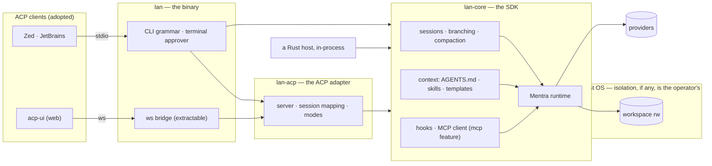

# lan — Architecture

> rev 8 · 2026-08-11 · **lan** — **L**ightweight **A**gent **N**ucleus
> The *how*. For the *why* — problem, idea, bets — see [`PROPOSAL.md`](PROPOSAL.md);
> locked decisions live in [`adr/`](adr/); deferred ideas in [`proposals/`](proposals/);
> research grounding in [`p0-groundwork.md`](p0-groundwork.md).
> **Note (2026-08-11):** ADR-0010…0015 redirect the design toward an SDK-first
> shape. **Phases A and B of that transition have landed** — watch retired,
> bounds moved onto runs, shell default flipped, no shipped container, the CLI
> grammar of ADR-0015, and the split into `lan-core` / `lan-acp` / the binary
> with MCP behind a feature and approval as a trait — and §2 and §4 below
> describe the state after them. The SDK proper (Phase C) and bindings (Phase D)
> are not built; where this document still describes the P0–P4 shape it says so.
> The ledger and phases are in [`REDESIGN.md`](REDESIGN.md).
> Reference bar: [pi](https://github.com/earendil-works/pi) (earendil-works) — minimal core, complete harness.
> General-purpose: no domain assumptions. Periodic bug-checking is one use case, never a design input.

lan is a coding-agent harness in Rust, built on [Mentra](https://github.com/oops-rs/mentra), with
the shape pi proved out: a small but **complete** core — sessions, compaction, multi-provider,
context conventions, extension points — everything else arriving as data or plugins. No TUI.
Embedding is the front door: ACP for editors and web UIs, a JSONL event stream for scripts, the
crate itself as the SDK.

## 1. The bar: what "full-functional" means

pi's thesis: *stay small at the core while being extended through extensions, skills, prompt
templates, and packages.* Its core is nonetheless complete — sessions with branching and tree
navigation, context compaction, unified multi-provider access, RPC headless mode, an SDK,
hot-reloadable extensions. Two pi decisions independently validate ours:

- **No built-in permission system.** pi ships none and says "containerize or sandbox pi" —
  the posture we arrived at independently and adopted knowingly in ADR-0013: the boundary is
  the OS's, documented rather than shipped.
- **Embedding via protocol.** pi's RPC mode is a bespoke JSONL protocol over stdio. We take the
  same architecture but adopt the *standard* — ACP — so every existing client works without a
  custom client library.

| Capability (pi has it) | Ours | Source |
|---|---|---|
| Agent loop + tool calling | Mentra runtime, async tool traits | mentra |
| Multi-provider LLM API | mentra-provider: OpenAI, Anthropic, Gemini, OpenRouter, Ollama, LM Studio | mentra |
| Session persistence + resume | SQLite-backed sessions, snapshots | mentra |
| Compaction | Memory compaction exists in mentra; wire to session lifecycle | mentra + glue |
| Session branching / tree | mentra's transcript tree, exposed on `PreparedRun` ✅ | built |
| Builtin tools (shell, files, background exec, tasks) | Mentra builtins | mentra |
| Context files (AGENTS.md) | Loader: workspace + global, parent-dir walk | build |
| Skills (on-demand) | SKILL.md discovery, description-first loading | build |
| Prompt templates (/commands) | Markdown templates with args, exposed over ACP as commands ✅ | built |
| Extensions (custom tools, event interception) | MCP servers + subprocess hooks, allow/deny/modify (§3) ✅ | built |
| Packages (shareable bundles) | Directory convention over skills/templates/hooks/MCP — defer | later |
| RPC / headless mode | `run --json` event stream + **ACP** (standard, not bespoke) ✅ | built |
| SDK | `lan-core`, a Rust crate on Mentra — embed in-process; other languages use ACP | free |
| TUI / themes / keybindings | Out of scope by design — ACP clients own presentation | — |
| Provider OAuth login flows | API-key auth first; OAuth per provider later | later |

## 2. Principle: the core has no opinions

Task-specific behavior enters through data, never code: the **prompt**, the **workspace** (its
AGENTS.md, skills, templates, `.mcp.json`), and **config**. A periodic code-health check, a
nightly dependency bump, an interactive refactor are all the same to the binary. If a use case
seems to need core changes, close the gap generically or push it to an extension point.

```
lan                                # ACP server on stdio (the front door)
lan "<prompt>"                     # shorthand: exactly `lan run "<prompt>"`
lan run "<prompt>" [--json]        # headless one-shot, JSONL event stream
lan bridge                         # the same server on a websocket, for a browser
lan fingerprint                    # the workspace's hash, for a caller's own loop
```

The grammar is ADR-0015's and is the whole CLI. Recurrence is not in it: an interval is the
host's (cron, systemd, CI, a tokio task), and the two pieces that are easy to get wrong — the
fingerprint and per-run bounds — are a subcommand and three flags on `run` (ADR-0014).

## 3. Extension model (without embedding a scripting language)

pi's extensions are TypeScript modules loaded into a TS host — free for them, expensive for a
Rust binary. Equivalent coverage, Rust-native:

| pi extension capability | lan mechanism |
|---|---|
| Custom tools for the LLM | **MCP servers** (`rmcp`): any language, process-isolated, ecosystem standard |
| Event interception (block/modify tool calls) | **Hooks**: Mentra's authorization/policy layer in-process + subprocess hooks (exec a command, JSON in/out, allow/deny/modify) |
| Custom commands | Prompt templates, surfaced as ACP commands |
| Custom UI | ACP client's job (permission requests, input prompts are protocol messages) |
| In-process extension with full API access | The `lan-core` crate: the harness is a library first, binary second |

> If subprocess hooks + MCP prove too coarse, an embedded scripting layer (wasm or rhai) is the
> escalation path — decided by evidence, not up front.

## 4. Architecture



- **Crate layering mirrors pi's package layering**: mentra-provider ≈ pi-ai, mentra ≈
  pi-agent-core, lan ≈ pi-coding-agent minus TUI. Since ADR-0011 lan is itself three crates,
  split by dependency weight rather than by release schedule (they share one version):
  **`lan-core`** is the in-process SDK and carries no protocol, no transport, and no TTY
  code; **`lan-acp`** is the ACP adapter over its event stream and seams, opt-in by
  dependency; **`lan`** is the binary over both, and still what an editor spawns. MCP is a
  default-on `mcp` feature of `lan-core`, so an embedder can compile a core that has never
  heard of it (ADR-0012). The websocket bridge stays in the binary, marked extractable: it
  is ACP-ecosystem tooling with no lan-specific knowledge, and never an identity argument
  for lan.
- **ACP is the default mode** — running `lan` with no subcommand serves the protocol, because
  the embedded case is the primary case.
- **Sessions**: an ACP session *is* a mentra agent — lan uses the persisted agent id as the
  protocol's session id, so `session/load` is `Runtime::resume_session` and lan stores no
  mapping of its own (ADR-0007). A session outlives a turn, which is what makes conversation
  and resume possible at all; compaction wires to context-pressure events.
- **The mentra/lan split** (same author owns both): anything a *different* harness could also
  want — session branching, compaction lifecycle, hook points, MCP client — belongs in mentra.
  lan keeps conventions and protocol: AGENTS.md/skills/template discovery, ACP mapping, the
  CLI grammar.
- **Confinement**: the boundary is the OS's and lan ships no instance of it (ADR-0013,
  amending ADR-0004). Shell and background execution are on by default; a run holds the
  authority of the account that starts it, and lan never claims otherwise. In-process there
  is hygiene only — workspace path roots, and a policy that keeps `.git/hooks` and agent
  config read-only to the *file tools* (codex's anti-escape carve-out), which a shell
  redirect walks past. [`containerization.md`](containerization.md) documents the
  read-only-root pattern lan used to ship; a native per-command sandbox (Seatbelt on macOS,
  bubblewrap+seccomp on Linux, codex's `workspace-write` design) stays parked in
  [`proposals/0002`](proposals/0002-native-sandbox.md) as an *optional* later layer, not a
  return to denying commands by default.

## 5. Research notes (2026-08-08)

- **ACP (Agent Client Protocol)** is the standard: JSON-RPC 2.0 over stdio, LSP-style; v1
  stable; adopted by Zed, JetBrains, Copilot, Gemini CLI, 25+ agents; official Rust crate
  (`agent-client-protocol`). Web/mobile clients exist: acp-ui, acp-mobile — only a small
  WebSocket↔stdio bridge to write, no frontend to build.
- **codex** (OpenAI) is the counter-example on protocol — no ACP; a proprietary
  not-quite-JSON-RPC app-server that even its own SDKs bypass — but the reference on
  sandboxing: per-command wrapping (`codex-rs/sandboxing/src/manager.rs`), `workspace-write`
  policy with `.git`/agent-config kept read-only *inside* the workspace, network default-deny
  in three layers (seccomp, netns unshare, SBPL omission).
- **pi** (`/Users/wendell/developer/WeNext/ai/pi`): study `packages/coding-agent/docs/`
  session-format.md and compaction.md as prior art in P0.
- **zentox**: `mentra/docs/mentra-api-feedback.md` describes a prior Mentra-based agent and
  catalogs its API friction — requirements input for lan's core, whatever its domain was.

## 6. Plan

| Phase | Scope | Estimate |
|---|---|---|
| P0 Groundwork | Mine `mentra/docs/mentra-api-feedback.md`; read pi session-format + compaction docs; decide mentra-vs-lan split per capability | done |
| P1 Crate + `run` | Mentra wiring, AGENTS.md loader, skills discovery, worktree hygiene, JSONL event stream. Acceptance: arbitrary prompts on arbitrary repos, in-process and as subprocess | done |
| **P2 ACP server** ✅ | `agent-client-protocol` crate; session mapping, permission surfacing, modes, listing, history replay. Sessions survive turns, so conversation and resume work independent of protocol | done |
| **P3 Extension points** ✅ | MCP client honoring `.mcp.json` *and* the servers an ACP client sends; subprocess hooks (allow/deny/modify); prompt templates surfaced as ACP commands; ws↔stdio bridge for acp-ui | done |
| **P4 Loop + Docker** ✅ | `watch` scheduler with skip-if-unchanged — retired by ADR-0014, its bounds and fingerprint kept; Dockerfile, state volume, shell grant — withdrawn by ADR-0013 for [`containerization.md`](containerization.md) | done |
| P5 Depth | Branching ✅ — two-way since mentra 0.16, so an abandoned line of work can be returned to; compaction tuning, packages convention, provider OAuth remain | ongoing |

This table is the record of how lan was built, not the current plan. What follows P5 is the
SDK-first transition of ADR-0010…0015, phased in [`REDESIGN.md`](REDESIGN.md) §3: Phase A
(posture and pruning) and Phase B (structure — the crate split, the `mcp` feature, approval
as a trait) have landed; C (the SDK) and D (bindings) are open.

Validation stays deliberately varied — a refactor, a doc task, a test-writing task, *and* a
periodic check — so no single use case bends the API toward itself.

## 7. Risks and open questions

- **Scope honesty.** pi-class is a real harness, not a demo: sessions + compaction + extensions
  + protocol is weeks, not days, to polish. The phase order front-loads the embeddable core.
- **Extension expressiveness.** MCP + subprocess hooks may prove coarser than pi's in-process
  TS extensions. Escalation path (wasm/rhai) is named but deferred until friction is shown.
- **ACP crate maturity.** Official but young; budget for permission-flow gaps; acp-ui's traffic
  monitor is the debugger.
- **Mentra co-evolution.** Same author on both sides: gaps lan hits become mentra changes, not
  workarounds. The discipline is direction, not permission — capabilities generic enough for
  any harness land in mentra; lan keeps only harness-specific glue. Track each gap as a mentra
  issue even when fixing it immediately, so the API story stays legible to other mentra users.
- **Compaction quality.** Mentra has the primitive; behavior under long sessions is unproven.
  pi's compaction doc is the reference to study in P0.
- **Name collision.** `lan` collides with the networking acronym; searchability will be poor.
  Accepted trade-off — the expansion (Lightweight Agent Nucleus) leans into it rather than
  fighting it.
